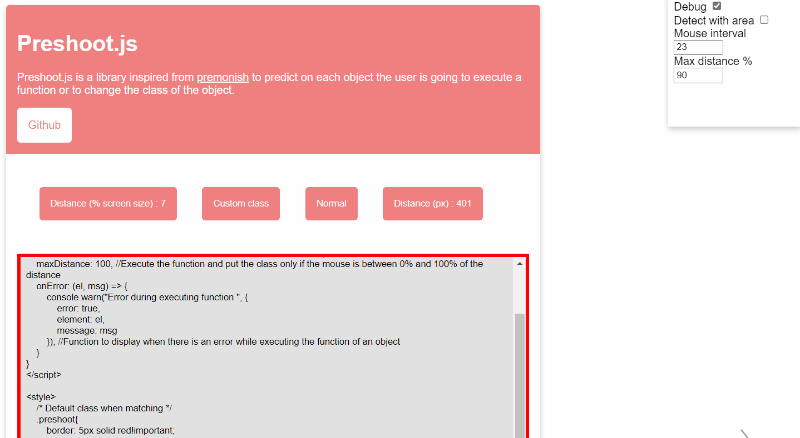

# PreshootJs v2

PreshootJsV2 is new version of preshoot.js a library inspired from <a href="https://mathisonian.github.io/premonish">premonish</a> to predict on each object the user is going only with attributes to execute a function or to change the class of the object.



## Demo
- https://yoannchb-pro.github.io/PreshootJsV2/

## Import
```html
<!-- IN THE HEAD -->
<!-- CDN -->
<script type="text/javascript" src="https://cdn.jsdelivr.net/gh/yoannchb-pro/PreshootJsV2@latest/lib/preshootv2.js"></script>

<!-- NORMAL -->
<script type="text/javascript" src="./lib/preshootv2.js"></script>
```

## How to use ?
Config preshoot.js
```js
    const preshoot = new Preshoot(["#watchMe", ".watchMe"], {
        fn: (event) => {
            console.log(event);
        },
        exitFn: (event) => {
            console.log(event);
        },
        className: "user-going-on"
    }, {
        detectWithArea: false, //If the cursor is not going on an object preshoot.js will detect the closer object
        mouseInterval: 30, //The calcul will be make each 30 mouse move loop
        resetClass: true, //Reset all the class if there are no matching element anymore
        //Function to display when there is an error while executing the function of an object
        onError: (el, msg) => {
            console.warn("Error during executing function ", {
                error: true,
                element: el,
                message: msg
            });
        }
    });

    //Debug mode
    Preshoot.debugMode(preshoot);

    //Start observing
    preshoot.start();

    //Stop observing
    preshoot.stop();
```
Set the default class when matching
```css
 /* Default class when matching */
.preshoot{
    border: 5px solid red!important;
}
```
How to use attributes ?
```html
<!-- Watching -->
<div id="watchMe"></div>
<div class="watchMe"></div>
```
